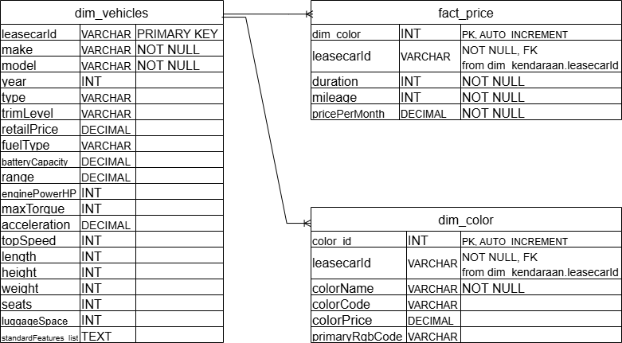

# Vehicle Lease Data Scraping Project

This project established a **clean, structured, and analysis-ready data pipeline** utilizing scraped data from private vehicle lease offerings.

Through a rigorous **ETL (Extract, Transform, Load)** process implemented using **Python** and **MySQL**, the raw, disparate datasets were normalized and integrated into an efficient **relational database schema** (Star Schema).

## Objective

The primary goal of this project was to provide a consistent and high-integrity dataset to support deep business analysis, achieving the following:

1. **Consistent Data Structure**: Transforming separated raw datasets into four interconnected relational tables: `dim_vehicles`, `fact_price`, and `dim_color`.

2. **Integrity Validation**: Ensuring referential integrity between the fact and dimension tables through strict primary/foreign key validation and ID-based filtering.

3. **Analysis Readiness**: Delivering efficient, denormalized SQL queries to enable comparative analysis of lease pricing against various factors, including duration, mileage, and vehicle specifications.

**Please input your Database Connection Configuration to file `config.json`**

---


## Project Structure

```
.
├── Schema/                 -> Schema for MYSQL Table
│   └── Create Table.sql    -> Create tables script from MYSQL
│   └── Schema.png          -> ERD Diagram for Database Schema
├── scraped_data/           -> CSV files of scraped_data
│   └── data_color.csv      -> csv file for color data
│   └── data_price.csv      -> csv file for price data
│   └── data_specs.csv      -> csv file for car data including the specifications
├── sql_output/             -> Query Result
│   └── data_color.csv      -> csv file for query result
├── config.json             -> File to store Database Connection Configuration
├── insert.py               -> Script to insert scraped data to MYSQL Tables
├── query.py                -> Script to SQL query that produces a clean, analysis-ready CSV export from Mysql
├── query.sql               -> Script to SQL query use for query in query.py file
├── scraping.py             -> Script to Scrapes Data
└── README.md
```
<hr>

## Requirements

- MYSQL database
- Python packages (installed inside Airflow Docker image):
  - pandas
  - mysql.connector
  - requests
  - tabulate

<hr>


## Database Schema
